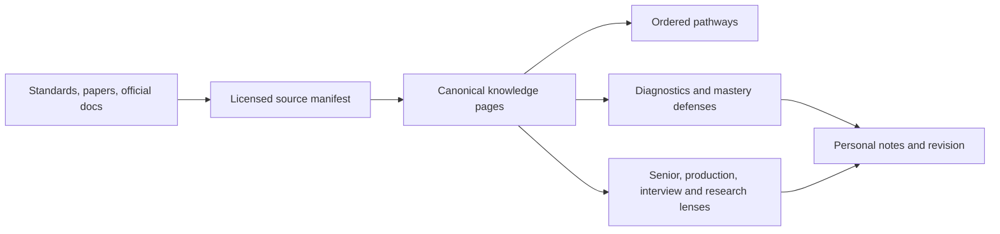

# Engineering Knowledge Atlas

[](https://github.com/MohammedUmarAsif/engineering-knowledge-atlas/actions/workflows/validate.yml)
[](https://github.com/MohammedUmarAsif/engineering-knowledge-atlas/releases)
[](LICENSE.md)
[](LICENSE.md)
[](00-meta/quality-review.md)

> A public, source-backed study system for learning AI engineering as a connected discipline: from model mechanics to retrieval, agents, production operations, security, system design, and research criticism.

This is not a link dump or a collection to finish. It is the map I use to decide what I should understand next, what I can genuinely skip, and what I still cannot explain under pressure.

## Why I am building this

My immediate goal is strong AI-native developer interview readiness by October 2026. I am preparing to design production systems, trace failures across layers, defend trade-offs, and say what evidence would change my decision instead of memorizing definitions.

My longer horizon connects full-stack engineering with C++ game development, Game AI research and a possible PhD in Japan. Japanese is a parallel long-term track. Keeping these goals in one atlas makes shared ideas (state, search, memory, uncertainty, distributed coordination, simulation, evaluation and human factors) visible instead of relearning them in isolation.

The repository is evidence of a study process, not a substitute for shipped systems, experiments or credentials. Mastery must survive explanation, implementation, criticism and revision.

## At a glance

| Signal | Current evidence in v0.1.1 |
|---|---|
| AI-native progression | 7 completed modules from LLM foundations through production security and governance |
| Maintained material | 110+ Markdown pages and 45,000+ words |
| Source discipline | 66 catalogued curricula, standards, papers, official documentation sets and production repositories |
| Implementation intuition | 6 paired Python/C++ examples covering contracts, retrieval, RAG, agents, admission control and effect policy |
| Depth model | L0 orientation → L1 foundation → L2 application → L3 production → L4 senior judgment → L5 research |
| Quality controls | Link, metadata, prerequisite-graph, navigation, manifest, Python and C++ checks locally and in CI |
| Currency | Dated reviews; volatile tools, regulations and specifications are separated from durable mechanisms |

## Inspect the reasoning, not the claims

| If you want to assess… | Start here |
|---|---|
| End-to-end production reasoning | [Production AI system map](knowledge/ai-engineering/06-production-ai-operations/system-map.md) |
| Workflow and agent architecture | [Deterministic workflows before open loops](knowledge/ai-engineering/05-agents-workflows-mcp/workflow-architecture.md) |
| Evaluation discipline | [RAG evaluation science](knowledge/ai-engineering/04-rag-systems-evaluation/evaluation-science.md) |
| Security boundaries | [System-specific AI threat modeling](knowledge/ai-engineering/07-ai-security-governance-red-teaming/threat-modeling.md) |
| Research judgment | [Agents and multi-agent research frontier](knowledge/ai-engineering/05-agents-workflows-mcp/research-frontier.md) |
| Language-level mechanics | [Python and C++ examples](examples/) and the [language policy](00-meta/language-and-code-policy.md) |

## Current learning map

| Track | Progression | Status |
|---|---|---|
| AI-native engineering | Foundations → model applications → document intelligence → RAG → agents/MCP → production operations → security/governance | **Modules 01–07 complete** |
| AI system-design interviews | Requirements → architecture → capacity → failure diagnosis → trade-off defense | **Next** |
| Full-stack product engineering | Browser → frontend → APIs → identity → data → queues/cache → cloud → observability/security | Scaffolded |
| Game development | C++ systems → engine architecture → design → narrative → production | Long-term pathway scaffolded |
| Game AI research | Classical game AI → learning agents → evaluation → experimental design → research questions | Long-term pathway scaffolded |
| Japanese | Foundations → daily proficiency → professional and academic communication | Parallel pathway scaffolded |

The [AI-native pathway](pathways/01-ai-native-developer/README.md) is the current priority. [CURRENT-FOCUS.md](CURRENT-FOCUS.md) is the live study queue; [MASTER-ROADMAP.md](MASTER-ROADMAP.md) keeps the other ambitions visible without letting them compete with the immediate goal.

## How the atlas works



- **Pathways** are ordered playlists with an explicit current priority.
- **Knowledge** holds one canonical explanation of each concept.
- **Lenses** force the same concept through production, interview, senior and research questions.
- **Library** records provenance, licensing and review dates; public availability alone never grants redistribution rights.
- **Notes** are reserved for durable understanding in my own words.
- **Examples** use Python first for immediate AI fluency and C++ where ownership, types and systems mechanics clarify the idea.

Every complete module must include prerequisites, an answer-aloud diagnostic, an explicit skip destination, mechanism, trade-offs, failure modes, production implications, misconceptions, current tools, primary sources, research questions and a mastery defense. See the [curriculum contract](00-meta/curriculum-standard.md), [teaching standard](00-meta/teaching-and-depth-standard.md) and [quality review](00-meta/quality-review.md).

## Academic and professional benchmarking

The atlas is benchmarked against ACM/IEEE-CS/AAAI CS2023, IEEE SWEBOK, official specifications and selected current course material from Harvard, MIT and Oxford. Those references influence coverage, prerequisite structure and depth; they do **not** imply institutional affiliation, degree equivalence or completion of those universities' curricula.

The mapping is explicit and auditable in [Academic Benchmarks and Source Map](00-meta/academic-source-map.md). Foundation-level material establishes durable mechanisms, advanced material develops system integration and uncertainty, and research-level sections require criticism of evidence, limitations, ablations and open questions. “Research depth” is a mode of reasoning, not a credential label.

## Begin or run locally

1. Read [START-HERE.md](START-HERE.md).
2. Attempt each module diagnostic aloud before reading.
3. Skip only when the explanation is precise without notes.
4. Use the senior and production lenses before marking a concept understood.

For a searchable local site:

```bash
python3 scripts/docs.py serve
```

Then open `http://127.0.0.1:8000`. The repository also includes a focused [VS Code reading setup](00-meta/vscode-reading-setup.md).

## Licensing and contributions

Original educational content is licensed under CC BY 4.0; code examples and scripts use the MIT License. Third-party sources retain their own terms. Corrections that improve accuracy, evidence, learning progression or failure analysis are welcome. See [LICENSE.md](LICENSE.md), [CONTRIBUTING.md](CONTRIBUTING.md) and the [source and copyright policy](00-meta/source-and-copyright-policy.md).
