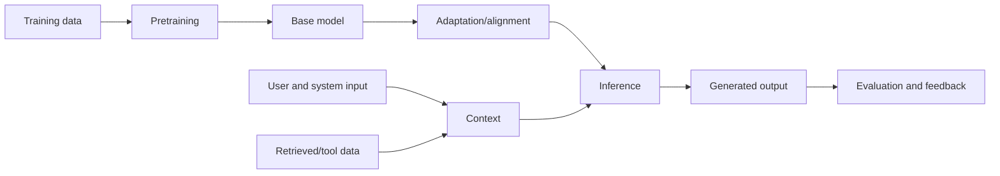

# AI-Native Foundations

## Purpose

Build the minimum correct mental model needed to reason about modern AI applications without confusing models, retrieval systems, agents, or product orchestration.

## Prerequisites

Basic programming, functions, vectors, probability, HTTP APIs, and databases. These are diagnosed rather than retaught here.

## Diagnostic: skip only if you can answer all of these aloud

1. Why does a language model generate one token at a time rather than retrieve a stored sentence?
2. What does a context window contain, and what does it not change about the model?
3. What information does an embedding preserve, and why is cosine similarity not truth?
4. Distinguish pretraining, instruction tuning, preference optimization, inference, and retrieval.
5. Explain temperature without saying only that it controls “creativity.”
6. Why can a lower-temperature model still hallucinate?
7. What is the difference between model capability, application reliability, and factual grounding?
8. Where can nondeterminism enter an AI product besides sampling?
9. Why can a larger context window make an answer worse?
10. When should conventional software replace an LLM call?

If any response is vague, continue from [Tokens and Context](tokens-and-context.md). If every answer is precise, skip to [Model Application Engineering](../02-model-application-engineering/README.md).

## Core map

The model supplies probabilistic capability. The application supplies context, tools, control flow, validation, permissions, persistence, observability, and user experience. Production quality is an end-to-end property, not a model property.

## Reading order

1. [Tokens and Context](tokens-and-context.md)
2. [Embeddings](embeddings.md)
3. [Transformer and LLM Lifecycle](transformer-lifecycle.md)
4. [Inference and Generation](inference.md)
5. [Limitations and Failure Modes](failure-modes.md)
6. [Mastery and Interview Review](mastery.md)
7. [Tools and Research Map](tools-and-research.md)

## Primary references

- [Attention Is All You Need](https://doi.org/10.48550/arXiv.1706.03762)
- [Harvard CS50 AI, 2026 syllabus](https://cs50.harvard.edu/summer/ai/2026/syllabus/)
- [Oxford Machine Learning, 2025–26](https://www.cs.ox.ac.uk/teaching/courses/2025-2026/ml/)
- [Stanford AI Index](https://aiindex.stanford.edu/report/)
