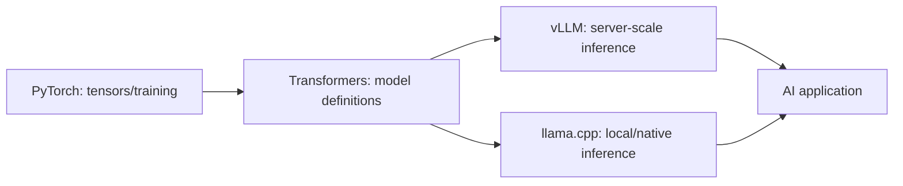

# AI Foundations Tools and Research Map

GitHub stars are approximate snapshots checked on 2026-08-27 and are discovery signals only.

## Learn the stack by layer

### [PyTorch](https://github.com/pytorch/pytorch): tensor and training foundation

- Approximately 102k stars; BSD-style core license; active 2026 releases; Python frontend with substantial C++/accelerator internals.
- Study it to connect tensors, automatic differentiation, modules, devices, compilation, and distributed execution.
- Do not mistake framework fluency for understanding optimization, generalization, or model evaluation.

### [Hugging Face Transformers](https://github.com/huggingface/transformers): model definitions and ecosystem bridge

- Approximately 163k stars; Apache-2.0; supports text, vision, audio, video, and multimodal architectures.
- Study configuration, tokenizers, model classes, generation, checkpoints, and model cards.
- The project itself warns that examples require adaptation and that it is not a generic neural-network building-block library.
- Treat downloaded weights and remote code as supply-chain inputs requiring trust review.

### [vLLM](https://github.com/vllm-project/vllm): production inference serving

- Approximately 89k stars; Apache-2.0; high-throughput, memory-efficient serving.
- Study batching, KV-cache management, scheduling, quantization, distributed inference, throughput/latency, and compatible serving APIs.
- It solves model-serving concerns, not application authorization, grounding, or product evaluation.

### [llama.cpp](https://github.com/ggml-org/llama.cpp): local/native inference

- Approximately 113k stars; MIT; C/C++ with broad hardware support.
- Study quantized model representation, CPU/GPU offload, memory mapping, native inference, and constrained/local deployment.
- Review model provenance and sandbox untrusted artifacts; local execution does not automatically make a system secure.

## How the pieces connect

The boundaries overlap, but the conceptual separation prevents “the model,” “the runtime,” and “the product” from becoming one vague idea.

## Active research and engineering frontiers

### Efficient inference

KV-cache management, continuous batching, quantization, speculative decoding, tensor/pipeline/expert parallelism, and hardware-aware kernels trade memory, throughput, latency, and quality. Claims must be measured on the actual model, context, batch pattern, and hardware.

### Long context

Longer limits do not guarantee effective use. Research concerns positional generalization, retrieval within long sequences, attention cost, memory, lost-in-the-middle behavior, and evaluation beyond synthetic needle tasks.

### Mixture of experts

Sparse activation can increase parameter capacity without using every parameter for every token, but introduces routing, load balancing, communication, memory, and deployment complexity.

### Small and local models

Distillation, quantization, synthetic data, and task specialization can make smaller models valuable for privacy, latency, offline games, edge devices, and bounded workflows. Capability must be evaluated per task rather than inferred from parameter count.

### Multimodal world models and agents

Models increasingly connect language with images, audio, video, actions, and environments. Open problems include reliable grounding, temporal understanding, controllability, persistent memory, evaluation, and safe action.

## Game and research transfer

- Local C++ inference matters for games with latency, privacy, cost, or offline requirements.
- Small models may drive dialogue or perception, while deterministic game logic retains authority.
- Game environments remain useful laboratories for planning, reinforcement learning, multi-agent behavior, communication, and human-agent interaction.
- A PhD question needs a falsifiable gap and evaluation method, not merely the application of the newest model to a game.
