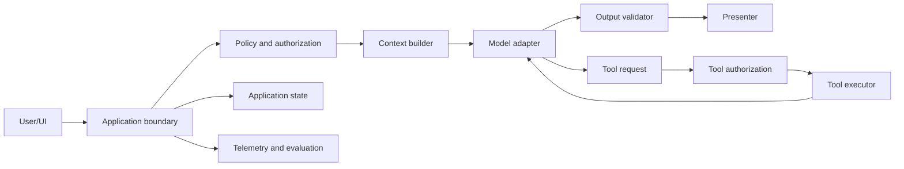

# Model Application Engineering

## Purpose

Learn to turn a probabilistic model into a dependable product component. The model is one dependency inside a conventional software system; the application remains responsible for authorization, state, validation, side effects, observability, and user trust.

## Prerequisite

Complete [AI-Native Foundations](../01-foundations/README.md), or pass its exit diagnostic.

## Diagnostic: skip only if you can answer all of these aloud

1. How would you isolate provider-specific request and response formats from domain logic?
2. When should you use structured output rather than tool calling?
3. Why is schema-valid output not necessarily semantically valid?
4. Which parts of an effective prompt are instructions, trusted context, untrusted data, and output constraints?
5. How do you stop retrieved text from gaining the authority of a system instruction?
6. Who executes a custom tool call, and where must authorization occur?
7. How do you make a tool with side effects idempotent and reviewable?
8. What state belongs in the provider, application database, cache, and user-visible transcript?
9. What can go wrong after output has already been streamed to a user?
10. How would you compare two models for a specific production workload?
11. What must be logged to reproduce an AI incident without retaining unnecessary sensitive data?
12. How should the product behave when the model, provider, tool, or validator is unavailable?

If any answer is vague, continue with [API Architecture and Model Selection](api-architecture.md). If all answers are precise, continue to [Document Intelligence and Retrieval](../03-document-intelligence-retrieval/README.md).

## System map

The model can propose text, structure, or actions. It does not inherit authority merely because it proposed them.

## Reading order

1. [API Architecture and Model Selection](api-architecture.md)
2. [Instructions and Context Construction](instructions-and-context.md)
3. [Structured Outputs and Validation](structured-outputs.md)
4. [Tool Calling and Side Effects](tool-calling.md)
5. [Streaming, State, and Memory](streaming-state-memory.md)
6. [Multimodal Applications](multimodal.md)
7. [Reliability, Security, and Operations](reliability-security-operations.md)
8. [Mastery and Interview Review](mastery.md)
9. [Implementation Patterns: Python and C++](implementation-patterns.md)
10. [Tools and Research Map](tools-and-research.md)

## Primary references

- [JSON Schema specification](https://json-schema.org/specification)
- [OWASP GenAI Security Project](https://owasp.org/www-project-top-10-for-large-language-model-applications/)
- [OpenAI API documentation](https://platform.openai.com/docs/)
- [Anthropic API documentation](https://docs.anthropic.com/)
- [Google Gemini API documentation](https://ai.google.dev/gemini-api/docs)
