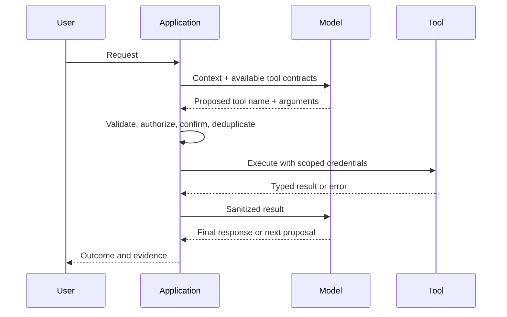

# Tool Calling and Side Effects

## Diagnostic

Skip to [Streaming, State, and Memory](streaming-state-memory.md) if you can design a tool boundary with authorization, validation, idempotency, confirmation, timeout, audit, and recovery.

## Mental model

A tool call is an untrusted proposal from the model. Application code decides whether, how, and under whose authority it executes.

## Lifecycle

## Tool contract

Define:

- narrow name and purpose;
- typed arguments and result;
- authenticated principal and tenant;
- read versus write behavior;
- side effects and reversibility;
- timeout and resource limit;
- idempotency strategy;
- error taxonomy;
- audit fields;
- confirmation policy.

Descriptions influence model selection but do not provide security.

## Authorization

Authorize at execution time using trusted application identity and current resource state. Never accept a user ID, tenant ID, role, or permission merely because the model supplied it.

## Side effects

For consequential operations:

- separate planning from execution;
- display the exact proposed action;
- require confirmation where appropriate;
- use idempotency keys;
- make retries aware of ambiguous completion;
- prefer reversible actions;
- record actor, request, approval, result, and correlation ID.

## Parallel and sequential calls

Parallel calls reduce latency only when operations are independent. Dependencies, shared state, quotas, or side effects require explicit ordering. A model's proposed order is not a transaction.

## Tool-result safety

Tool output is also untrusted context. It may contain malformed data, secrets, excessive content, or embedded instructions. Validate, minimize, redact, and label it before returning it to the model.

## Failure modes

- wrong tool selected;
- plausible but invalid arguments;
- authorization confused with model instruction;
- duplicate purchase/message/refund;
- timeout after the side effect succeeded;
- tool result contains prompt injection;
- excessive tool catalogue reduces selection quality;
- loop repeatedly invokes the same tool;
- model claims success despite a tool error.

## Senior questions

- Could this tool be two narrower tools?
- What is the blast radius of compromised model behavior?
- Can the action be simulated or previewed?
- How will ambiguous completion be reconciled?
- What should happen when a user revokes permission mid-workflow?

## Interview scenario

Design an email-sending tool for an assistant. Cover drafts, recipients, attachment access, confirmation, idempotency, delivery failure, prompt injection in quoted email, and auditing.
