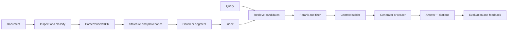

# Document Intelligence and Retrieval

## The motivating problem

A human opens a PDF and sees a heading, two columns, a table, a footnote, a chart, and a signature. A naïve parser may see characters in drawing order. A retrieval system may then split the broken text, embed the fragments, and confidently retrieve the wrong clause.

RAG cannot repair evidence destroyed during ingestion. Document intelligence begins before embeddings.

## Diagnostic: skip only if you can answer all of these aloud

1. Why is a PDF primarily a page-description format rather than a semantic document format?
2. How do born-digital, scanned, and hybrid PDFs require different processing?
3. Distinguish text extraction, OCR, layout analysis, table recognition, and document understanding.
4. Why can OCR have high character accuracy but still produce an unusable retrieval corpus?
5. What information is lost when a table is flattened into plain text?
6. How would you preserve page, region, heading, and source provenance through chunking?
7. When is fixed-size chunking defensible, and when does it destroy meaning?
8. Compare lexical, sparse learned, dense, hybrid, and late-interaction retrieval.
9. Why is cosine similarity not a probability that a passage answers a question?
10. Compare exact and approximate nearest-neighbour search.
11. Why should retrieval and generation be evaluated separately?
12. How would you prevent one tenant from retrieving another tenant's document?
13. What should happen when two authoritative documents conflict?
14. Why might page-image retrieval outperform an OCR-first pipeline?

If any answer is vague, continue with [From PDF to Evidence](pdf-to-evidence.md). If all are precise, continue to [RAG Systems and Evaluation](../04-rag-systems-evaluation/README.md).

## Pipeline map

Every arrow is a potential information-loss, security, latency, and evaluation boundary.

## Reading order

1. [From PDF to Evidence](pdf-to-evidence.md)
2. [OCR, Layout, Tables, and Reading Order](ocr-layout-tables.md)
3. [Chunking, Metadata, and Indexing](chunking-metadata-indexing.md)
4. [Retrieval Models](retrieval-models.md)
5. [Reranking and Context Assembly](reranking-context.md)
6. [Evaluation, Security, and Operations](evaluation-security-operations.md)
7. [Tools and Repository Map](tools-and-repositories.md)
8. [Research Frontier](research-frontier.md)
9. [Python and C++ Retrieval Mechanics](implementation-patterns.md)
10. [Mastery and Interview Review](mastery.md)

## Outcome

You can trace a source document into a cited answer, identify where meaning may be lost, select a retrieval architecture based on evidence, and operate it with measurable quality, permissions, freshness, and cost.
