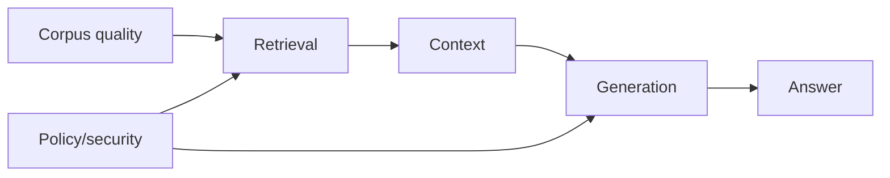

# RAG Evaluation Science

## Start with a causal map

Measure nodes separately before interpreting end-to-end change.

## Dataset construction

Each case should include:

- user/query context;
- authorized corpus snapshot;
- relevant evidence and acceptable alternatives;
- expected claims or answer rubric;
- no-answer/conflict status;
- risk and query category;
- language/document type;
- provenance and annotator confidence.

Separate development and held-out sets. Record when production feedback enters either. Avoid generating all tests with the same model being evaluated.

## Retrieval metrics

- Recall@k for evidence coverage;
- Precision@k for context noise;
- MRR/nDCG for ordering;
- authorization correctness;
- freshness and valid-time correctness;
- latency and cost.

## Generation metrics

- claim correctness;
- claim completeness;
- evidence groundedness;
- context utilization;
- citation precision/recall;
- abstention correctness;
- contradiction handling;
- instruction and style adherence.

## Evaluators

### Deterministic

Schema, IDs, citations, exact fields, calculations, latency, cost, access rules. Prefer deterministic checks where possible.

### Human

Best for nuanced usefulness, ambiguity, authority, writing quality, and high-risk adjudication. Require clear rubrics and agreement analysis.

### Model-based

Scalable for semantic judgments but sensitive to evaluator model, prompt, ordering, verbosity, self-preference, and missing domain knowledge. Calibrate against humans, use blinded comparisons, and version the evaluator.

## Experimental design

For a proposed improvement:

1. state the failure it targets;
2. preregister primary metrics/slices where rigor matters;
3. keep other components fixed;
4. compare against simple baselines;
5. report variance and paired outcomes;
6. inspect regressions, not only averages;
7. include latency, cost, and operational complexity;
8. test statistical and practical significance.

## RAGChecker lesson

Fine-grained evaluation research reinforces that retriever quality, context utilization, relevant noise, hallucination, and self-knowledge are distinct behaviours. Better recall can bring more relevant evidence and more noise simultaneously.

## PhD-level questions

- Does the metric measure the construct it names?
- Could evaluator preference explain the result?
- Does the test distribution match deployment?
- Are improvements due to leaked corpus/test knowledge?
- What negative result would change the architecture?
